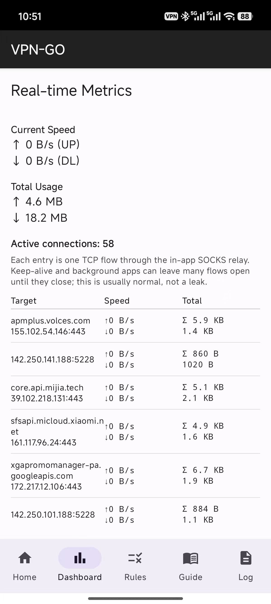
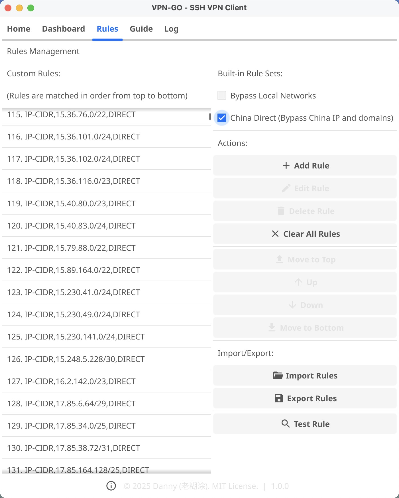
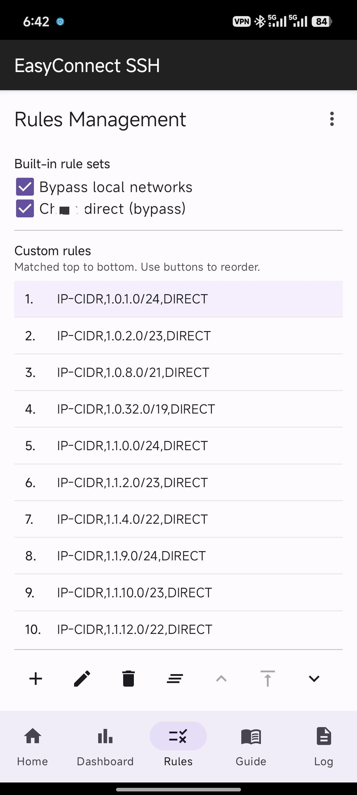

# 客户端使用指南

ssh-vpn 提供图形界面（GUI）与命令行（CLI）两种使用方式，初学者推荐直接使用跨平台的客户端软件一键连接。

## 准备工作

1. 前往 **[客户端下载页面](/zh/download)** 获取您的操作系统对应的安装包。
2. 您需要准备一个可用的 SSH 服务器（如个人 VPS、公司跳板机，或第三方厂商如 `龙虾 OpenClaw` 服务器）。

## 桌面端客户端 (推荐) 🖥️

无论是为了科学连接海外 AI 服务（如 ChatGPT、Gemini），还是为了远程接入企业内网，桌面客户端都能提供开箱即用的体验。

<div class="device-row" style="margin: 2rem 0;">
  <div class="device-container device-pc">
    
  </div>
</div>

1. **运行应用程序**：双击启动您下载好的 macOS `.dmg` 或是 Windows `.exe` 程序。
2. **添加配置**: 点击 "Add Profile" 新增节点配置。
    - **Server**: 服务器的 IP 与对应 SSH 端口（如：`8.8.8.8:22`）。
    - **用户名**: 服务器 SSH 用户名（如 `root`）。
    - **认证方式**: 
        - **SSH Key** (强烈推荐): 提供您的私钥文件路径（如 `~/.ssh/id_rsa`），安全便携。
        - **Password**: 如果您没有配置密钥，可以直接填写登录密码。
    - **代理模式**:
        - **SOCKS5 Proxy**: 在本地建立 `1080` 端口的代理通道。
        - **TUN Mode**: 全局全量接管您的电脑网络（类似传统 VPN）。
3. **连接**：选择保存好的配置，点击 **Connect**。

<div class="device-row" style="margin: 2rem 0;">
  <div class="device-container device-mobile">
    
  </div>
</div>

> **关于 TUN 模式的系统权限说明**
> 为了让系统顺理成章地使用代理，ssh-vpn 会新建一个虚拟网卡 (TUN Device)，并在后台修改系统主干路由表，以及监听 `127.0.0.1:53` 从而拦截接管所有 DNS 解析以防泄漏。
> **在 macOS/Windows/Linux 系统中，配置虚拟网络接口均需要管理员级/Root权限。**
> 如果您没有管理员授权，您可以使用无需提权的 **SOCKS5 代理模式**。

---

## 智能分流与规则引擎 (Smart Routing)

为了降低连接海外服务器的延迟和宽带消耗，ssh-vpn 客户端内置了强大的智能分流引擎。它允许您让国内网站直连、公司内网直连，而让被屏障锁定的国际网站通过代理节点转发。

<div class="device-row" style="margin: 2rem 0;">
  <div class="device-container device-pc" style="max-width: 500px;">
    
  </div>
  <div class="device-container device-mobile">
    
  </div>
</div>

- **高度兼容性**: ssh-vpn 的规则引擎格式完全兼容业界主流的配置模式。支持 `DOMAIN` (精确域名)、`DOMAIN-SUFFIX` (域名后缀与子域名匹配)、`DOMAIN-KEYWORD` (包含特定关键词) 以及 `IP-CIDR` 路由分流等主流判断语法。
- **配置与导入**: 打开客户端设置，您可以直接导入预先编写好的分流规则集。例如，我们官方提供的 `china_ip_rules.txt`，可以让所有的中国大陆IP和本地局域网无感跳过代理直连互联网。
- **自定义阻断拦截**: 除了 `PROXY` (转发) 和 `DIRECT` (局域网直连) 以外，引擎还支持 `REJECT` 动作来主动屏蔽某些包含追踪或广告系统的网络请求。

---

<details>
<summary><b>命令行基础连接 (高级用户)</b></summary>
<br/>

如果你在没有图形界面的机器上（如另一台 Server 或路由器）运行该客户端，可以使用自带的命令行指令连接：

```bash
# 示例：一次性临时连接新服务器，强行覆盖地址与端口
ssh-vpn-cli client -host 8.8.8.8 -port 22 -mode socks5

# 示例：载入预设配置环境（如包含密钥与复杂路由的 "公司内网" Profile）来静默连接
ssh-vpn-cli -profile "公司内网" client
```

*当代理连通以后（若非使用 TUN），您可以让其他软件（如浏览器或命令行）走本地 `127.0.0.1:1080` 代理：*

- **Firefox 浏览器**设置：网络与配置 -> 手动配置代理 -> SOCKS 主机填入 `127.0.0.1` 端口 `1080`，协议选 **SOCKS v5**。
- **命令行工具 CURL**: `curl --socks5 127.0.0.1:1080 https://ip.gs`

若需查阅更完整的本地接口调用参数与守护进程状态管理，请参考 **[CLI 命令行指南](/zh/guide/cli-reference)**。
</details>
