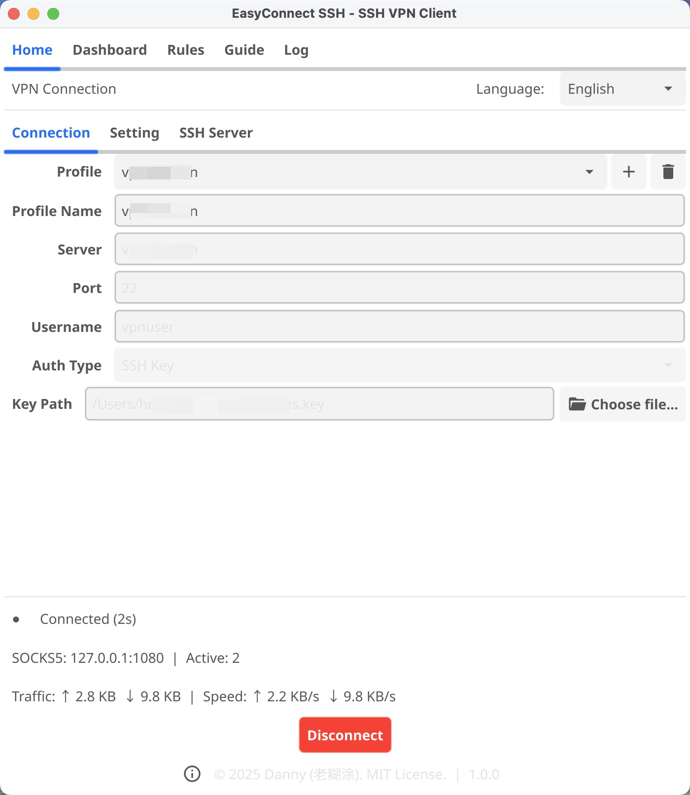
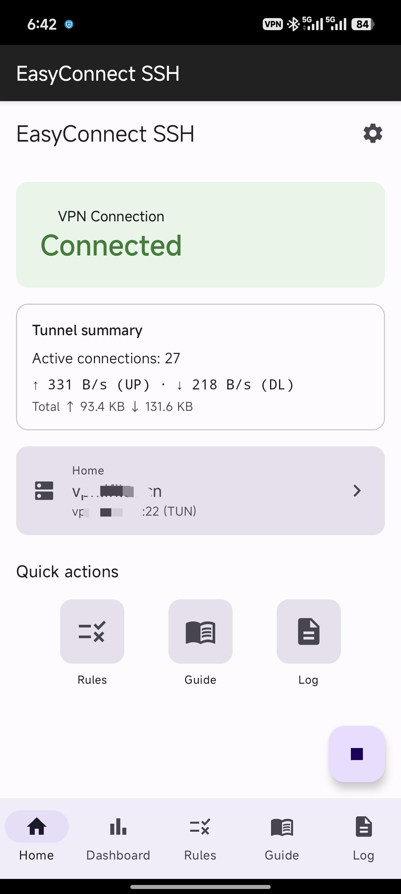

## 🖥️ 视觉体验 (Cross-Platform Experience)

无论是在 4K 桌面显示的宽广视野，还是在手机屏幕上的便捷操作，ssh-vpn 都能为您提供一致且流畅的交互体验。

  

    

    
  

  

    

    
  

*一处配置，全端同步。享受 SSH 所带来的极简连接魅力。*

## 👥 目标人群

无论您是技术专家还是网络安全关注者，ssh-vpn 都能完美适配您的需求：

- **AI 开发者与研究者**：搭配龙虾（OpenClaw）服务器，稳定访问 ChatGPT、Claude、Gemini 等全球顶级 AI 平台。
- **跨国协作团队**：大幅加速海外代码拉取（GitHub/GitLab）速度，流畅管理远程生产服务器。
- **隐私保护倡导者**：在机场、咖啡厅等公共 Wi-Fi 环境下，通过军用级 SSH 隧道保护您的网银与社交账号安全。
- **全球业务测试员**：在不同地域的网络环境下模拟真实用户访问，确保您的应用走出国门依然丝滑。
- **跨境电商从业者**：稳定管理 Amazon、Shopee、Lazada 等海外店铺，规避因网络波动导致的账号安全风险。
- **IT 运维工程师**：告别笨重且易被识别的 OpenVPN，享受基于标准 SSH 的极简、高稳内网接入。

## 🎯 应用场景

### 🤖 极致的 AI 辅助开发
直接在 ssh-vpn 中填入您的龙虾服务器凭证。无论是 TUN 全流量模式还是 SOCKS5 代理模式，都能让您的本地开发环境瞬间获得全球顶尖 AI 模型的力量。

### 💻 高效的远程办公与运维
通过 ssh-vpn 建立的加密隧道，您可以像在局域网内一样安全地访问公司内部系统、数据库和测试机。其轻量化的特性，即使在网络抖动的移动办公场景下也能保持连接不断连。

### 🛡️ 公共网络下的安全堡垒
ssh-vpn 将您的所有流量包裹在成熟的 SSH 协议中。在不安全的网络环境下，它是您抵御中间人攻击（MITM）和数据泄露的最坚实盾牌。

